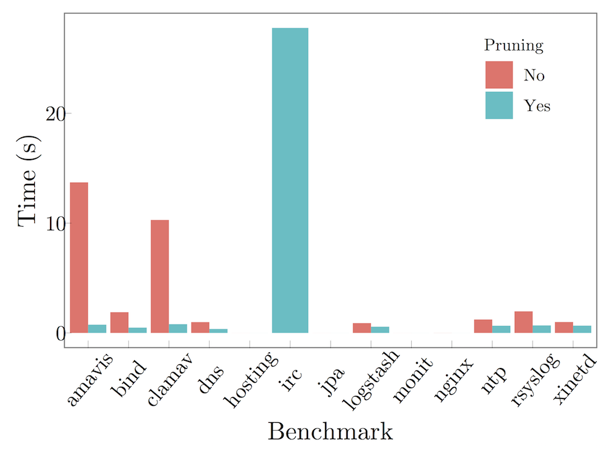
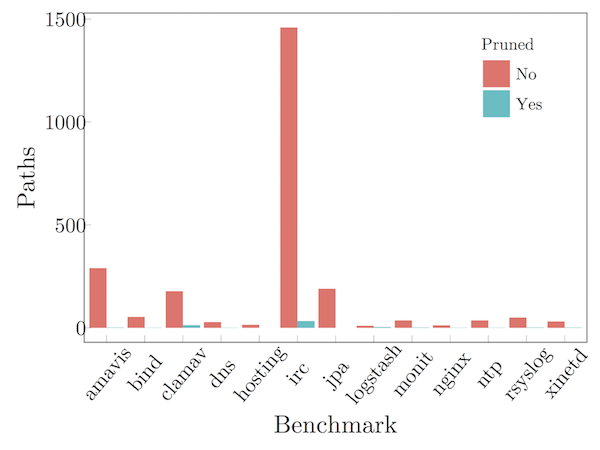
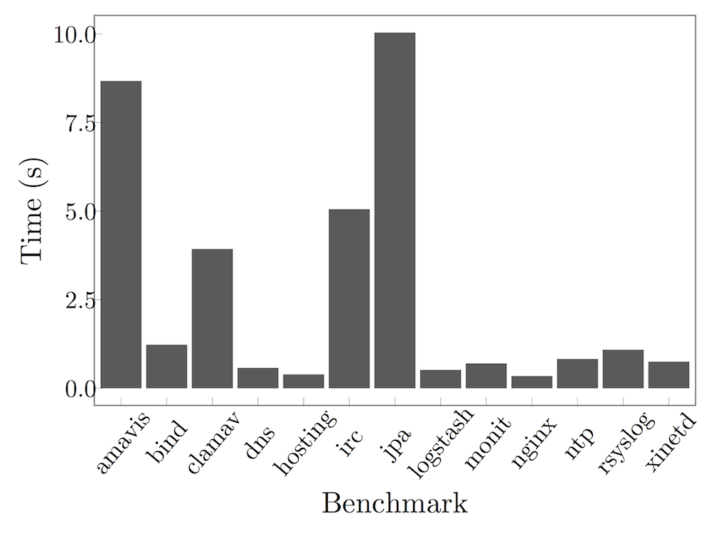

Rehearsal requires at least 8GB of memory and a 64-bit processor. The
tool should work with less memory, but some of our larger benchmarks may
not run (or run very slowly).

The Rehearsal software is available in two forms:

- A VirtualBox appliance that should run on platform supported by VirtualBox.
  [download here]

- Source code, which should work on Linux and Mac OS X. See the `README.md`
  file in the source code bundle for installation instructions.
  The source code includes a `Vagrantfile` that was used to create virtual
  machine above. [download here]

## Differences from the paper

We are actively working on Rehearsal and there are three differences
between this version and the version documented in the accepted paper.
We'll be documenting these differences in the camera ready version.

- We've replaced the algorithm in Figure 9 with a a simpler version that is much
  more effective. The code in `src/main/scala/DeterminismPruning.scala`
  implements the new algorithm and the pruning algorithm in Figure 10 (which is
  unchanged).

  As a result, Figure 12(b) now looks like this (i.e., it is improved):

  

  The bars for *monit*, *nginx*, and *hosting* are near zero. (We'll format it
  better for the camera ready version.)

- We've updated the *irc* benchmark with a newer version from Github. The
  only significant change to the benchmark is that several more users were
  added, so it grew substantially larger. Figure 12(a) shows the difference:

  

  However, note with the change to Rehearsal documented above, the tool is
  actually faster on the larger benchmark.

- **Bugfix**: In Section 5, in the paragraph on Idempotence Checking, the paper
   says:

   > The check can be optimized further by pruning writes (section 4.3)

   While preparing the artifact, we realized that this is unsound to do so
   in certain cases. The tool uses a simpler optimization, which we will
   document in the camera-ready version.

   Figure 12(c) now looks like this:

   

   Idempotence-checking is no longer instantaneous. Therefore, the following
   claim in our submitted version is not correct:

   > Therefore, checking idempotence with determinism has a negligible overhead.

   We will revise this claim in the camera-ready.

